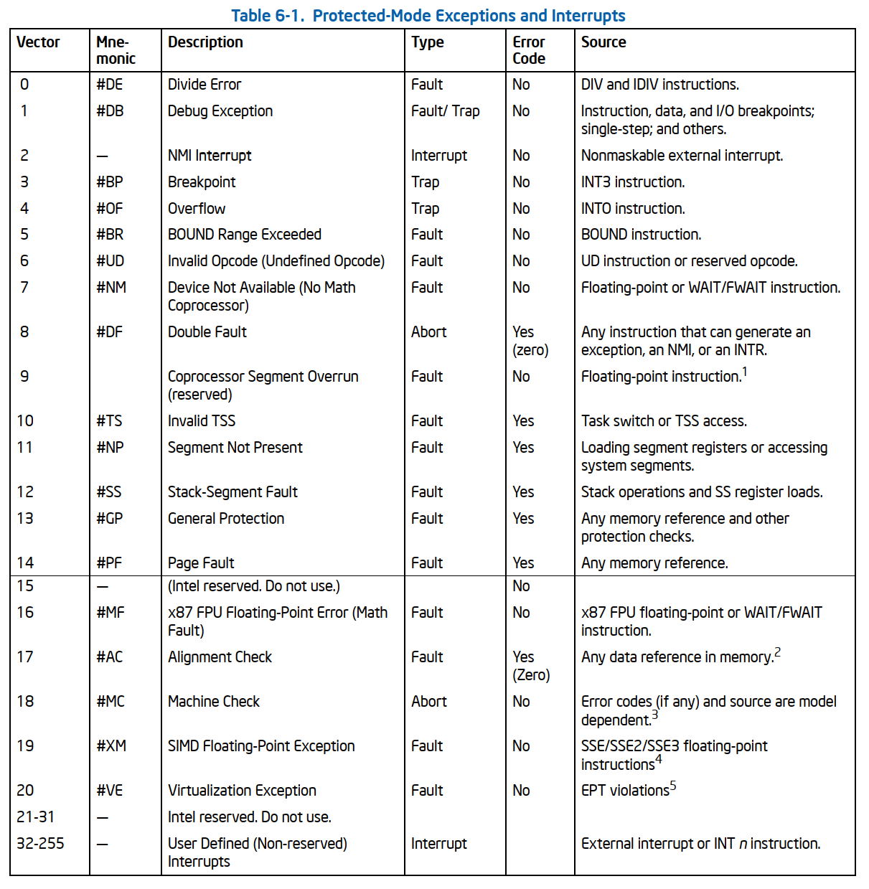
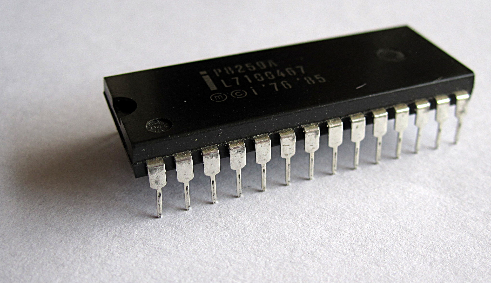

# Chapter 6 Interrupt and Exception Handling

## Interrupt And Exception Overview

- **Interrupts** and **exceptions** are events that indicate that a condition exists somewhere in the system, the processor, or within the currently executing program or task that requires the attention of a processor.
- They typically result in a forced transfer of execution from the currently running program or task to a special software routine or task called an **interrupt handler** or an **exception handler**.
- Interrupts occur at **random times** during the execution of a program, in response to **signals** from **hardware**. System hardware uses interrupts to handle events external to the processor, such as requests to service **peripheral devices**. Software can also generate interrupts by executing the `INT n` instruction.
- **Exceptions** occur when the processor detects an error condition while executing an instruction, such as **division by zero**. The processor detects a variety of error conditions including protection violations, page faults, and internal machine faults.

## Exception and Interrupt Vectors

- To aid in handling exceptions and interrupts, each architecturally defined exception and each interrupt condition requiring special handling by the processor is assigned a unique identification number, called a **vector number**.
- The processor uses the vector number assigned to an exception or interrupt as an **index** into the **IDT**.
- The allowable range for vector numbers is **0 to 255**. Vector numbers in the range **0 through 31** are reserved by the Intel 64 and IA-32 architectures for **architecture-defined** exceptions and interrupts.
- Vector numbers in the range **32 to 255** are designated as **user-defined interrupts** and are not reserved by the Intel 64 and IA-32 architecture. These interrupts are generally assigned to **external I/O devices** to enable those devices to send interrupts to the processor through one of the external hardware interrupt mechanisms .

## Sources of Interrupts

The processor receives interrupts from two sources:

- External (hardware generated) interrupts.
- Software-generated interrupts.

### External Interrupts

- External interrupts are received through pins on the processor or through the **local APIC**.
- On *Pentium 4*, *Xeon*, *P6* family, and *Pentium* processors, the relevant physical pins are called `LINT0` and `LINT1` ("Local INTerrupt"). These two pins are wired to the local APIC. What they actually *do* depends on whether the APIC is turned on or off.
- When the local APIC is **enabled**: You can configure these pins through something called the **Local Vector Table (LVT)** inside the APIC. The LVT lets you say *"when LINT0 gets a signal, treat it as interrupt vector N"* — basically mapping each pin to whichever of the 256 possible interrupt/exception vectors you want. This is flexible.
- When the local APIC is **disabled** (either globally or in hardware): The pins fall back to a legacy role. `LINT0` becomes the **INTR** pin and `LINT1` becomes the **NMI** pin. This is how older PCs worked before APICs existed.

**What INTR does (legacy mode)**

When something asserts the INTR pin, the CPU knows an external maskable interrupt has occurred. But the CPU doesn't yet know *which* interrupt — INTR is just a "hey, something happened" signal. So the CPU then reads a vector number off the system bus, which is supplied by an external interrupt controller chip — classically the **8259A PIC**. That vector number (0–255) tells the CPU which entry in the IDT to jump to, which in turn tells it which handler routine to run.

"Maskable" means software can disable these interrupts when it doesn't want to be bothered (using the `CLI` instruction to clear the interrupt flag).

**What NMI does**

The NMI pin signals a **Non-Maskable Interrupt**. As the name says, software *cannot* disable these — they always get through. NMIs are reserved for serious things like hardware failures, watchdog timeouts, or parity errors, where ignoring the signal isn't an option. NMI is hardwired to interrupt **vector 2** — there's no need to read a vector off the bus because it's fixed.

**The big picture**

So you have a hierarchy: modern systems use the APIC for flexible, programmable routing of many interrupt sources (especially important for multiprocessor systems). But the hardware preserves backward compatibility: turn the APIC off and the same physical pins revert to the old INTR/NMI scheme that talks to an 8259-style controller, just like a 1980s PC.

----

This passage continues the interrupt discussion, expanding from a single CPU's view out to the whole system: how interrupts get routed across chips and between processors, plus some legacy and edge-case details.

**The I/O APIC: the system-wide interrupt router**

Each CPU has its own *local* APIC built in. But devices in the system (disk controllers, network cards, USB, etc.) don't connect directly to any one CPU. Instead, their interrupt lines feed into a separate chip called the **I/O APIC**, which sits on the motherboard. Think of it as a central switchboard for device interrupts.

When a device asserts an interrupt at one of the I/O APIC's input pins, the I/O APIC looks up what vector number that pin is configured to use, then forwards a message to the appropriate **local APIC** (i.e., to the CPU that should handle it). The local APIC then raises the interrupt on its CPU.

The transport medium for that message depends on the processor generation:

- On Pentium 4, Core Duo, Core 2, Atom, and Xeon, the message travels over the regular **system bus** (front-side bus, or in newer chips, QuickPath/similar).
- On older P6 family and Pentium chips, there's a dedicated **APIC serial bus** — three wires used solely for APIC traffic.

Either way, the key point is that the I/O APIC decides the vector number and tells the local APIC, "deliver vector N to your CPU."

**Inter-processor interrupts (IPIs)**

In a multiprocessor system, CPUs sometimes need to interrupt *each other* — for example, to flush another CPU's TLB, halt it, or wake it up. This is called an **inter-processor interrupt (IPI)**. One CPU's local APIC sends a message directly to another CPU's local APIC over the same bus (system bus or APIC serial bus, depending on the generation). No I/O APIC involved — it's APIC-to-APIC.

**The legacy case: pre-APIC processors**

The Intel486 and earlier Pentium processors didn't have on-chip local APICs at all, and so they don't have LINT0/LINT1. Instead, they have dedicated, single-purpose **INTR** and **NMI** pins. External interrupts on these systems come from an off-chip **8259A** controller wired to the INTR pin — the classic PC architecture from the 1980s. This is the simpler world that the LINT-pins-in-disabled-APIC-mode was emulating in the previous passage.

**Other pins that interrupt the processor (but aren't "interrupts" in this chapter's sense)**

Finally, the manual notes that there are *other* pins that can disturb the processor's normal flow, but they aren't part of the standard interrupt/exception vector mechanism. They're more like out-of-band control signals:

- **RESET#** — resets the processor (cold restart).
- **INIT#** — re-initializes the processor without a full reset (preserves caches, etc.).
- **FLUSH#** — tells the CPU to write back and invalidate its caches.
- **STPCLK#** — "stop clock," used to put the CPU into a low-power state.
- **SMI#** — System Management Interrupt; transitions the CPU into **System Management Mode (SMM)**, a special privileged mode used by firmware/BIOS for things like power management and hardware workarounds, invisible to the OS.
- **R/S#** — Run/Stop, used for debug (halts the CPU for in-circuit debugging).

These bypass the normal IDT/vector dispatch entirely. They invoke special hardware-defined behavior. Whether each one even exists varies by processor model — you'd check the specific chip's datasheet.

**The takeaway**

Putting both passages together, the picture is:

- Devices → **I/O APIC** (on the motherboard) → routes via system bus or APIC serial bus → **local APIC** (on each CPU) → CPU interrupt handling.
- CPUs can also interrupt each other via local-APIC-to-local-APIC messages (IPIs).
- In legacy mode (no APIC), it's just: device → **8259A** → INTR pin → CPU.
- And there are several special control pins (RESET#, SMI#, etc.) that cause CPU disturbances but live outside the normal interrupt-vector machinery.

Want me to dig into how the I/O APIC's redirection table works, what an IPI looks like in practice, or what SMM actually does?

### Maskable Hardware Interrupts

- Any external interrupt that is delivered to the processor by means of the INTR pin or through the local APIC is called a **maskable hardware interrupt**.
- The IF flag in the EFLAGS register permits all maskable hardware interrupts to be masked as a group.

### Software-Generated Interrupts

- The **INT n** instruction permits interrupts to be generated from within software by supplying an interrupt vector number as an operand.
- Any of the interrupt vectors from 0 to 255 can be used as a parameter in this instruction.
- If the processor’s predefined NMI vector is used, however, the response of the processor will not be the same as it would be from an NMI interrupt generated in the normal manner
- Interrupts generated in software with the INT n instruction cannot be masked by the IF flag in the EFLAGS register.

## Sources of Exceptions

- The processor receives exceptions from three sources:
  - Processor-detected program-error exceptions.
  - Software-generated exceptions.
  - Machine-check exceptions.

### Program-Error Exceptions

- The processor generates one or more exceptions when it detects program errors during the execution in an application program or the operating system or executive.

### Software-Generated Exceptions

- The **INTO, INT1, INT3, and BOUND** instructions permit exceptions to be generated in software.
- The INT n instruction can be used to emulate exceptions in software; but there is a limitation.
- If INT n provides a vector for one of the architecturally-defined exceptions, the processor generates an interrupt to the correct vector (to access the exception handler) but does not push an error code on the stack. This is true even if the associated hardware-generated exception normally produces an error code. The exception handler will still attempt to pop an error code from the stack while handling the exception. Because no error code was pushed, the handler will pop off and discard the EIP instead (in place of the missing error code). This sends the return to the wrong location.

### Machine-Check Exceptions

- The P6 family and Pentium processors provide both internal and external machine-check mechanisms for checking the operation of the internal chip hardware and bus transactions.
- These mechanisms are implementation dependent. When a machine-check error is detected, the processor signals a machine-check exception (vector 18) and
returns an error code.

## Exceptions Classifications

- Exceptions are classified as **faults, traps, or aborts** depending on the way they are reported and whether the instruction that caused the exception can be restarted without loss of program or task continuity:
  - Faults: A fault is an exception that can generally be corrected and that, once corrected, allows the program to be restarted with no loss of continuity. When a fault is reported, the processor restores the machine state to the state prior to the beginning of execution of the faulting instruction. The return address (saved contents of the CS and EIP registers) for the fault handler points to the faulting instruction, rather than to the instruction following the faulting instruction.
  - Traps: A trap is an exception that is reported immediately following the execution of the trapping instruction. Traps allow execution of a program or task to be continued without loss of program continuity. The return address for the trap handler points to the instruction to be executed after the trapping instruction.
  - Aborts: An abort is an exception that does not always report the precise location of the instruction causing the exception and does not allow a restart of the program or task that caused the exception. Aborts are used to report severe errors, such as hardware errors and inconsistent or illegal values in system tables.

## Exception and Interrupt Handling
